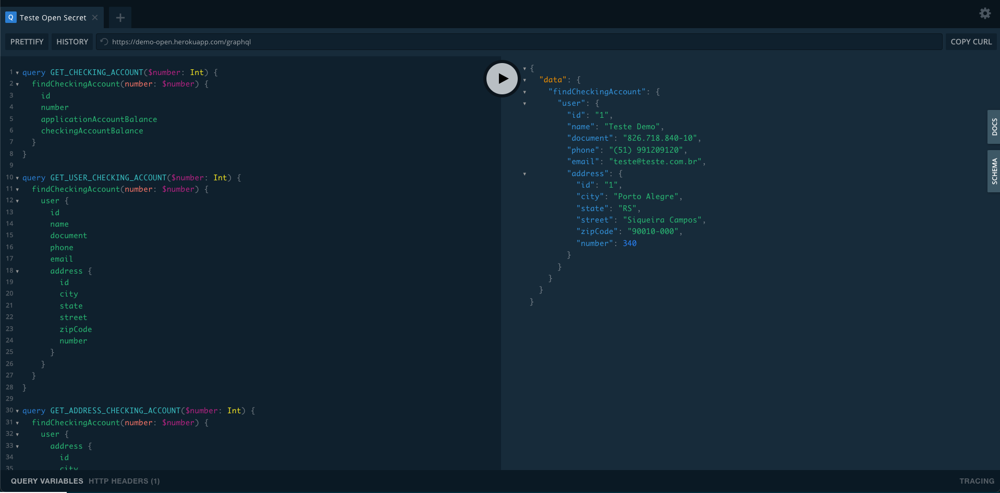

# POC GraphQL + Java 17 + SpringBoot

## Descrição:
Essa POC visa demonstrar o modelo de utilização da tecnologia GraphQL para fornecer recursos para projetos de "_**Mobile/WEB**_";

## Tecnologias
Para o desenvovimento dessa POC, foram utilizadas ás tecnologias abaixo:

|Tecnologia|Versão|
| :---    |:---: |
| Java     |JDK 17|
| SpringBoot | 2.6.0|
| Gradle | 7.2 |
| GraphQL Java | 12.+|

## Pré Requisitos:
- JDK 17;
- Gradle 7.2;

## Execução
- #### Local:
   - `./graldew clean build` 
   - `java -jar build/libs/poc-java-mock-0.0.1-alpha01.jar`

- #### Docker:
   - Docker e docker-compose instalados;
   - Docker:
     - `docker build -t poc-java-mock .` - Criar a imagem;
     - `docker run -d --name poc-java-mock -p 8080:8090 poc-java-mock` - Executar o container;
   - Docker Compose:
     -  `docker-compose up -d` - Criar a imagem e executar o container.
   - Verificar os logs:
      - `docker logs -f poc-java-mock`

## Documentação
Diferente de uma API Rest que utiliza o Swagger para documentar os contratos, no caso do GrphQL utiliza-se o playground:

- Acesso
  - [HerokuApp](https://demo-open.herokuapp.com/playground);
 

